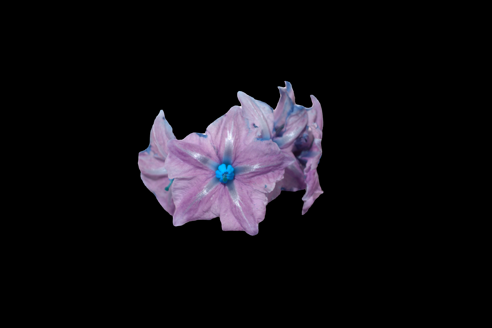
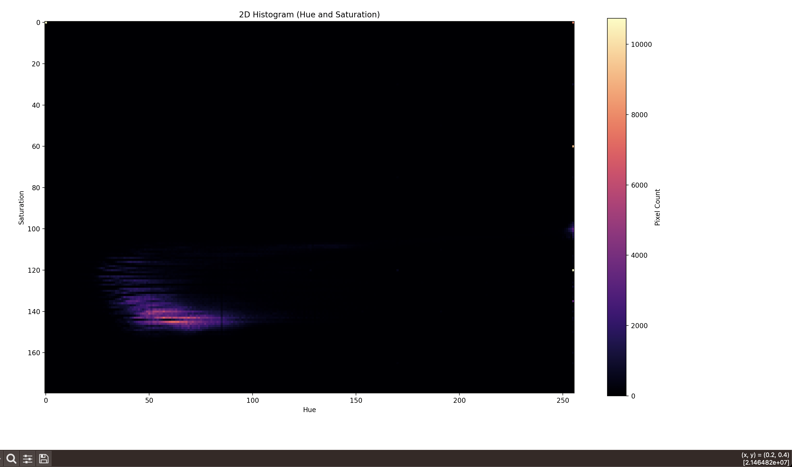

# Histogram

As know, background and things not segmented were sent to be black as shown in the following picture.


> NOTE: This picture was segmented with SAM2, remove not segmented pixels multipling the image by the mask and is in HSV color space.

That's why the histogram should looks like this, where most of the values will be close to (0,0)


> Note: the cursor is almost near to cero and looks the number of values there, because of the black background

For previous reason `vmin` and `vmax` where used on `plot_histogram`: These parameters set the data limits that the colormap covers. By using vmax=np.max(hist)/2000, you can reduce the upper limit, allowing for better contrast in areas with lower pixel counts. This makes subtle variations more apparent.

# Usage

```shell
python -m ImageProcessing.histogram2d /Users/giovannilopez/Downloads/2024-08-15_Cultivos/segmented_images/flower_DSC09170.jpg
```

The colormap can be specified:
```shell
python -m ImageProcessing.histogram2d /Users/giovannilopez/Downloads/2024-08-15_Cultivos/segmented_images/flower_DSC09170.jpg inferno
```

## Available Colormaps

You can choose from a variety of colormaps available in Matplotlib, such as:

* viridis (default)
* plasma
* inferno
* magma
* cividis
* gray
* hot
* cool